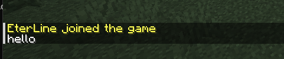
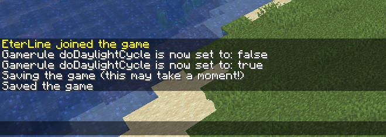
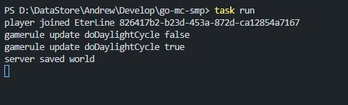

# go-mc-smp

Go client for Minecraft JSON-RPC


## Installation

```bash
go get github.com/eterline/go-mc-smp
```

## Features

- Players management: list, kick
- Allowlist management: get, add, remove, clear
- Server control: status, save, stop, system messages
- Gamerules: list, update
- Fully asynchronous JSON-RPC over WebSocket
- Context support and configurable call timeout
- Server notification event listening


## Usage

```go
package main

import (
	"context"
	"fmt"
	"time"

	"github.com/eterline/go-mc-smp"
)

func main() {
	smp, err := gomcsmp.NewClient("127.0.0.1", 9100, "YOUR_RPC_TOKEN", gomcsmp.WithCallTimeout(10*time.Second))
	if err != nil {
		panic(err)
	}
	defer smp.Close()

	msg := gomcsmp.SystemMessage{
		ReceivingPlayers: []gomcsmp.Player{gomcsmp.NewPlayer("EterLine")},
		Overlay:          false,
		Message:          gomcsmp.NewMessage("hello", "hello"),
	}

	sent, err := smp.ServerSystemMessage(context.Background(), msg)
	if err != nil {
		panic(err)
	}
	fmt.Println("Message sent:", sent)
}
```
Sending a System Message


## Usage with notification events

```go
package main

import (
	"context"
	"fmt"

	gomcsmp "github.com/eterline/go-mc-smp"
)

func main() {
	smp, err := gomcsmp.NewClient("127.0.0.1", 9100, "YOUR_RPC_TOKEN")
	if err != nil {
		panic(err)
	}
	defer smp.Close()

	ctx := context.TODO()

	// USE WITH NEW CHANNEL CREATE!
	// IF YOU WILL USE THAT IN for{}!
	// THAT CAN CAUSE GORUTINES LEAK!
	gamerulesCh := smp.NotifyGamerulesUpdates(ctx)
	playersJoinedCh := smp.NotifyPlayersJoined(ctx)
	playersLeftCh := smp.NotifyPlayersLeft(ctx)
	serverSavedCh := smp.NotifyServerSaved(ctx)

	for {
		select {
		case u, ok := <-gamerulesCh:
			if !ok {
				return
			}
			fmt.Println("gamerule update", u.Key, u.Value)

		case p, ok := <-playersJoinedCh:
			if !ok {
				return
			}
			fmt.Println("player joined", p.Name, p.ID)

		case p, ok := <-playersLeftCh:
			if !ok {
				return
			}
			fmt.Println("player left", p.Name, p.ID)

		case <-serverSavedCh:
			fmt.Println("server saved world")
		}
	}
}
```




## DTO library schemas


### Untyped Game Rule
| Field |  Type  |
|-------|--------|
| value | string |
| key   | string |

### Typed Game Rule
| Field | Type                          |
|-------|-------------------------------|
| type  | string ("integer", "boolean") |
| value | string                        |
| key   | string                        |

```go
type GameRuleType string

const (
	UntypedGameRule GameRuleType = ""
	IntegerGameRule GameRuleType = "integer"
	BooleanGameRule GameRuleType = "boolean"
)

// GameRule - represents a game rule key-value pair in the server.
type GameRule struct {
	Type  GameRuleType `json:"type,omitempty"`
	Value string       `json:"value"`
	Key   string       `json:"key"`
}
```

### Incoming IP Ban
| Field  | Type   |
|--------|--------|
| reason | string |
| expires| string |
| ip     | string |
| source | string |
| player | Player |

```go
type IncomingIPBan struct {
	Reason  string `json:"reason"`
	Expires string `json:"expires"`
	IP      string `json:"ip"`
	Source  string `json:"source"`
	Player  Player `json:"player"`
}
```

### System Message
| Field            | Type          |
|------------------|---------------|
| receivingPlayers | Array<Player> |
| overlay          | boolean       |
| message          | Message       |

```go
type SystemMessage struct {
	ReceivingPlayers *PlayerRegistry `json:"receivingPlayers"`
	Overlay          bool            `json:"overlay"`
	Message          Message         `json:"message"`
}

```

### Kick Player
| Field  | Type    |
|--------|---------|
| player | Player  |
| message| Message |

```go
type KickPlayer struct {
	Player  Player  `json:"player"`
	Message Message `json:"message"`
}
```

### IP Ban
| Field  | Type   |
|--------|--------|
| reason | string |
| expires| string |
| ip     | string |
| source | string |

```go
type IPBan struct {
	Reason  string `json:"reason"`
	Expires string `json:"expires"`
	IP      string `json:"ip"`
	Source  string `json:"source"`
}
```

### User Ban
| Field  | Type   |
|--------|--------|
| reason | string |
| expires| string |
| source | string |
| player | Player |

```go
type UserBan struct {
	Reason  string `json:"reason"`
	Expires string `json:"expires"`
	Source  string `json:"source"`
	Player  Player `json:"player"`
}
```

### Message
| Field               | Type           |
|---------------------|----------------|
| translatable        | string         |
| translatableParams  | Array<string>  |
| literal             | string         |

```go
type Message struct {
	Translatable       string   `json:"translatable"`
	TranslatableParams []string `json:"translatableParams"`
	Literal            string   `json:"literal"`
}
```

### Version
| Field    | Type    |
|----------|---------|
| protocol | integer |
| name     | string  |

```go
type Version struct {
	Protocol int    `json:"protocol"`
	Name     string `json:"name"`
}
```

### Server State
| Field   | Type          |
|---------|---------------|
| players | Array<Player> |
| started | boolean       |
| version | Version       |

```go
type ServerState struct {
	Players *PlayerRegistry `json:"players"`
	Started bool            `json:"started"`
	Version Version         `json:"version"`
}
```

### Operator
| Field               | Type    |
|---------------------|---------|
| permissionLevel     | integer |
| bypassesPlayerLimit | boolean |
| player              | Player  |

```go
type Operator struct {
	Permission          int    `json:"permissionLevel"`
	BypassesPlayerLimit bool   `json:"bypassesPlayerLimit"`
	Player              Player `json:"player"`
}
```

### Player
| Field | Type   |
|-------|--------|
| name  | string |
| id    | string |

```go
type Player struct {
	Name string     `json:"name"`
	ID   *uuid.UUID `json:"id,omitempty"`
}
```
All upper schemas includes `*PlayerRegistry`
This structure Marshals and Unarshals as `[]Player` in JSON
```go
func NewPlayerRegistry(players []Player) *PlayerRegistry // player slice to registry
func (r *PlayerRegistry) Players() []Player // getter for player slice
func (r *PlayerRegistry) IDs() []uuid.UUID // returns only existed ids
```

## License

[MIT](https://choosealicense.com/licenses/mit/)
